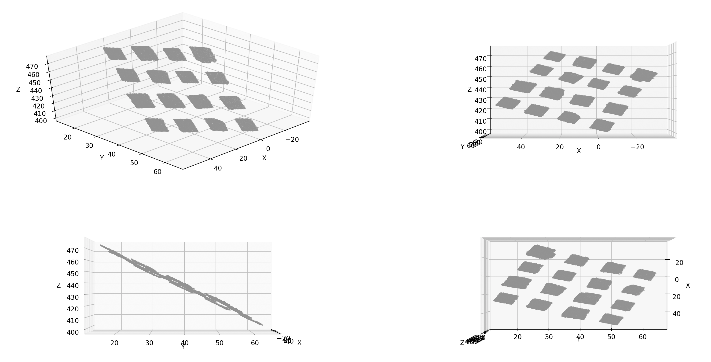
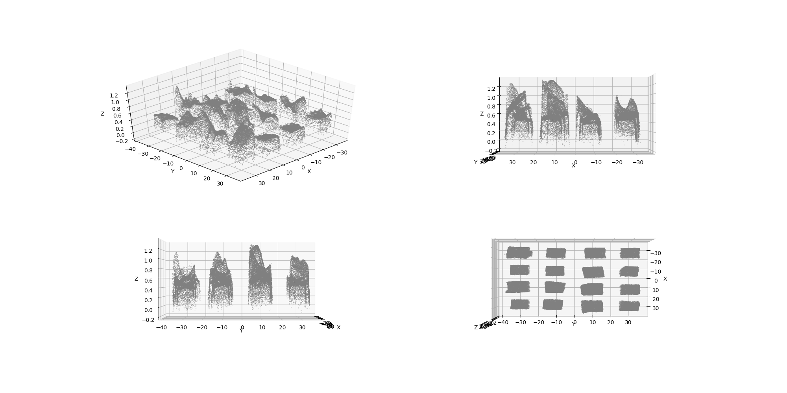
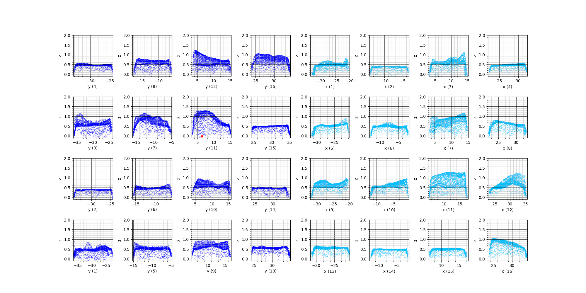

# Overview

This script parses *.3mf file of a 4x4 array of flat samples and calculates max thickness of each sample.

# How to install

1. Install Python

The script requires Python 3. The simplest way to get Python with necessary packages it to install Anaconda python distribution.

For Windows: https://docs.anaconda.com/anaconda/install/windows/
For Mac:https://docs.anaconda.com/anaconda/install/mac-os/

2. Install the script

Checkout with git
```
git clone https://github.com/densolo/trimesh-samples-measure.git
cd trimesh-samples-measure.git
```

Or download as zip from GitHub and unpack


3. Install dependencies


*MacOS*
```
cd trimesh-samples-measure

# create virutal environment to install dependencies
python -v venv venv
source venv/bin/activate

python -m pip install -r requirements.txt
```

# How to use

Run from the command line:
```
# optionally activate python environment
source venv/bin/activate

python tsm.py <file.3mf>
```

The script will produces several png images and csv file with thinknesses.

Example of the output:
```
% python tsm.py "data/Corner discs 1.3mf" 


Reading 3mf file data/Corner discs 1.3mf
Loaded 208476 3d points
Saving image into data/Corner discs 1-3d-origin.png
Rotate: -54.93582770793344 degree
Rotate: 0.114487000973867 degree
Rotate XY: -1.1101465845871266
Rotate: -1.1101465845871266 degree
Found 16 samples
X row [0] angle: -0.27
X row [1] angle: -0.09
X row [2] angle: -0.03
X row [3] angle: -0.04
Rotate XX: 0.10763046382174385 degree
Found 16 samples
calc_y_angles_by_rows
Y row [0] angle: -0.08
Y row [1] angle: 0.10
Y row [2] angle: 0.31
Y row [3] angle: 0.05
Rotate YX: -0.09546302025459237 degree
Adjust base-level by min Z-value: -0.243 ['-0.588', '-0.588', '-0.555', '-0.555', '-0.555', '-0.555', '-0.505', '-0.505', '-0.404', '-0.404']
Found 16 samples
SAMPLE     | MAX        | X          | Y         
01         | 0.904      | -35        | -29       
02         | 0.358      | -14        | -31       
03         | 1.121      | +02        | -30       
04         | 0.926      | +18        | -31       
05         | 0.783      | -32        | -14       
06         | 0.616      | -13        | -16       
07         | 1.118      | +03        | -15       
08         | 0.712      | +22        | -16       
09         | 0.776      | -32        | +13       
10         | 0.821      | -13        | +14       
11         | 1.282      | +04        | +08       
12         | 1.185      | +22        | +14       
13         | 0.942      | -32        | +28       
14         | 0.402      | -13        | +27       
15         | 0.469      | +06        | +32       
16         | 0.897      | +22        | +29       
Writing results in csv data/Corner discs 1.csv
Saving image into data/Corner discs 1-3d-rotated.png
Saving image into data/Corner discs 1-2d-matrix.png
```


# Calculation process
Orginal file:


Rotated:


Splited into samples:


Thickness of samples:
```
Found 16 samples
SAMPLE     | MAX        | X          | Y         
01         | 0.849      | -34        | -35       
02         | 0.427      | -14        | -28       
03         | 1.162      | +03        | -29       
04         | 0.452      | +22        | -33       
05         | 0.828      | -32        | -08
```
