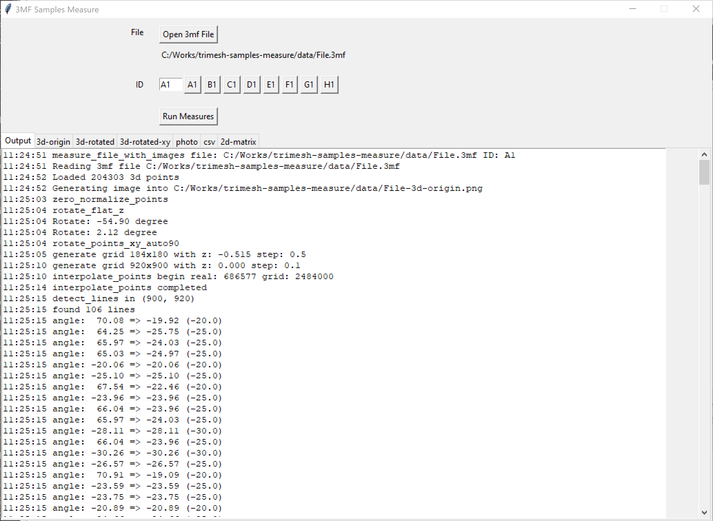
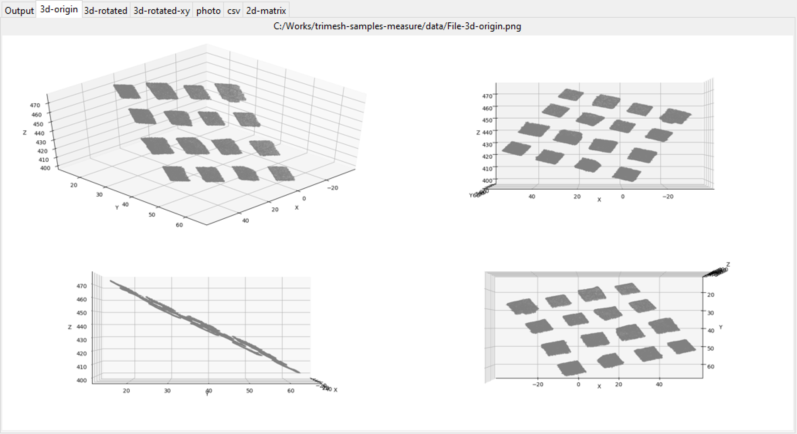
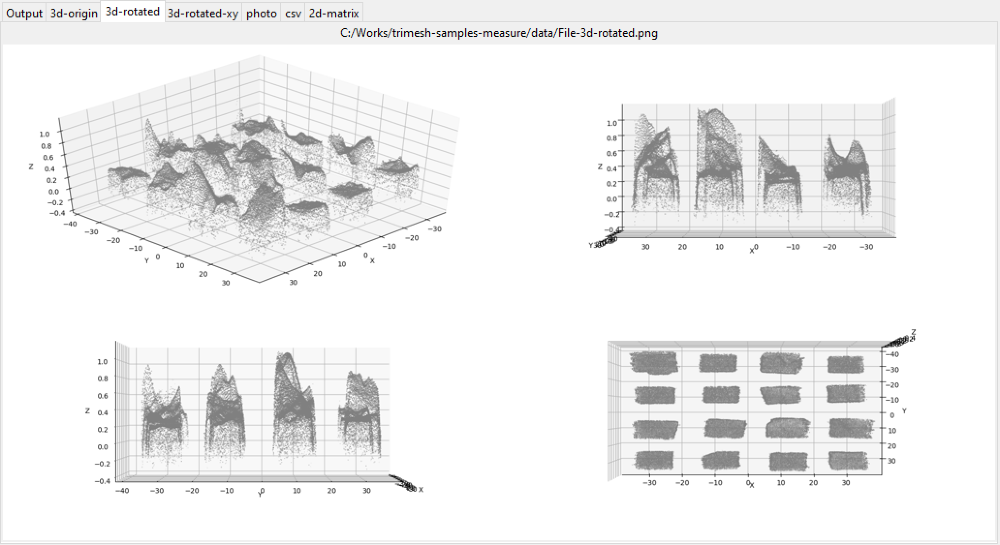
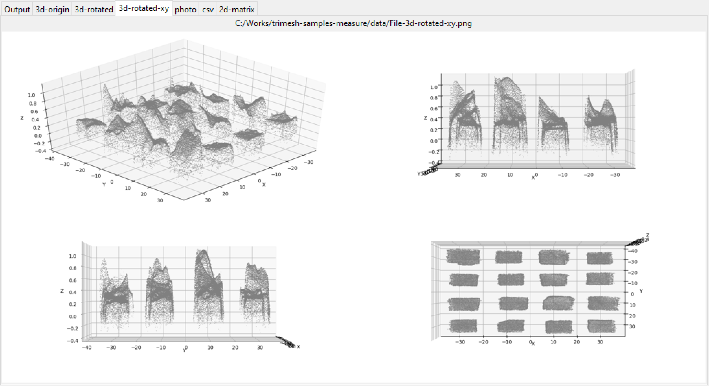
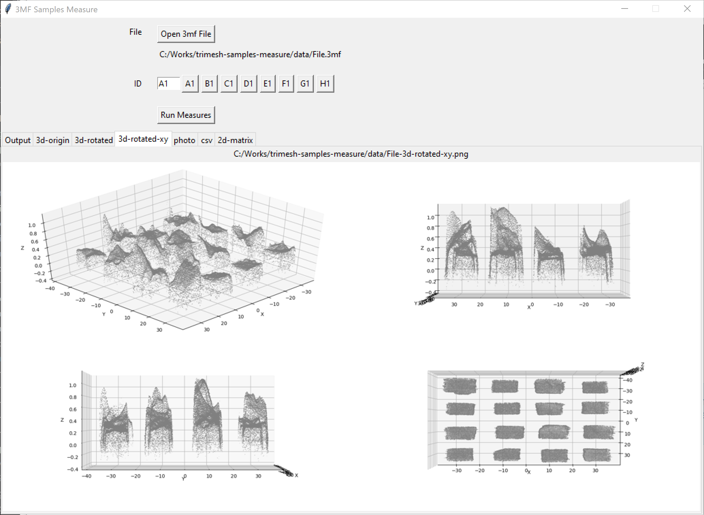
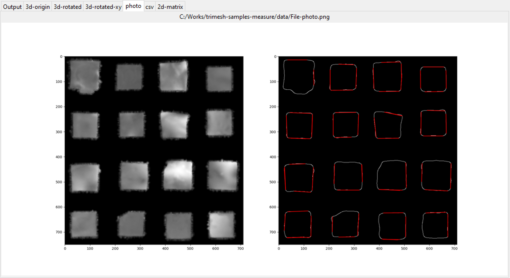
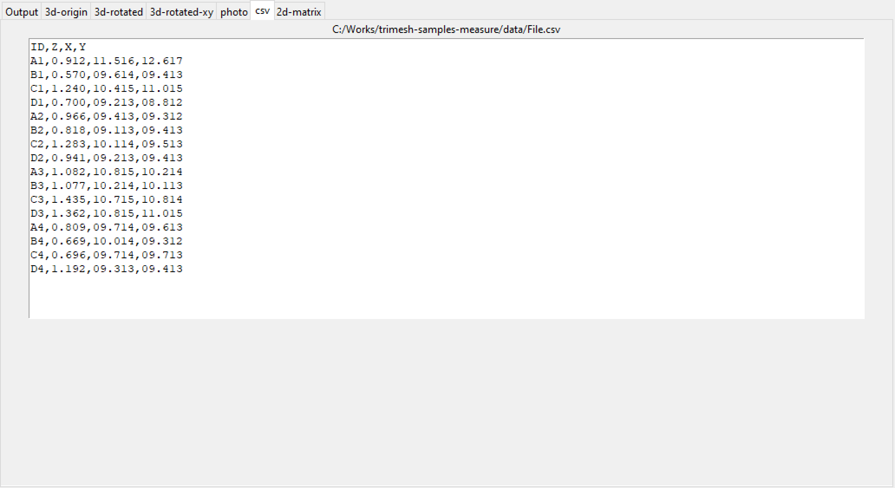
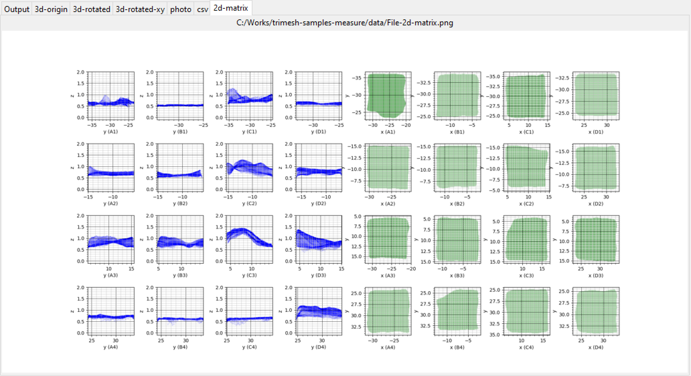

# Overview

This script parses *.3mf file of a matrix of flat samples and calculates max thickness and dimentions of each sample.

# How to use

1. Build the app (see next section)
2. Run the app dist/tsm_gui.exe
3. Open 3mf file 
4. Select ID (used for multiple scans)
5. Press the Run Measures button

Measure process will take up to few minutes. The program will open new tabs with interim results.
The final tabs will show csv with dimentions and 2d matrix of visual inspection.

