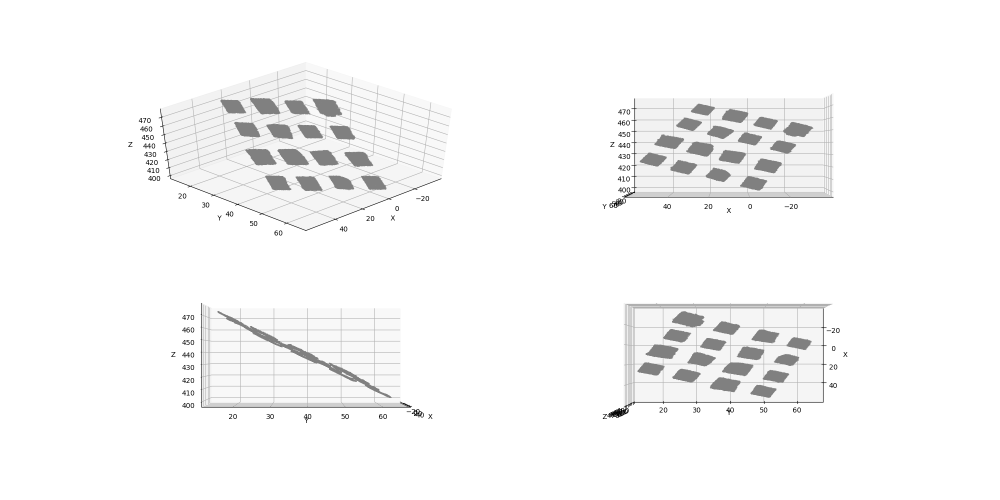

# Overview

This script parses *.3mf file of a 4x4 array of flat samples and calculates max thickness of each sample.

Orginal file:


Rotated:


Splited into samples:


Thickness of samples:
```
sample 01 thickness 0.927
sample 02 thickness 0.505
sample 03 thickness 1.191
sample 04 thickness 0.454
sample 05 thickness 0.859
sample 06 thickness 0.681
sample 07 thickness 1.096
sample 08 thickness 0.787
sample 09 thickness 0.908
sample 10 thickness 0.888
sample 11 thickness 1.278
sample 12 thickness 1.145
sample 13 thickness 0.579
sample 14 thickness 0.614
sample 15 thickness 0.510
sample 16 thickness 1.002
```
